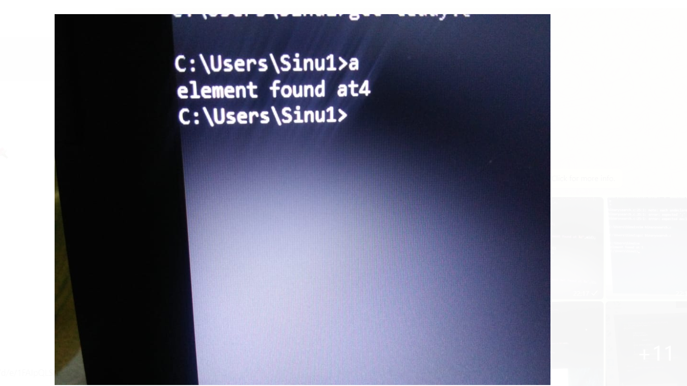

#AIM OF THE EXPERIMENT :Writing linear search program  by using non recursive functions.

##LINEAR SEARCH:This is to find whether a number is present in an array.If it is present,then what location it occurs..we will be comparing each element to search until we find it.Whether  the array is in sorted way or not it doesnt matter.

###STEP BY STEP PROCEDURE :

 First we will be taking an array of 10 elements and they are a[i]={12,61,33,92,36,3,29,98,54,60}.

 The first element position is considered as "i" which is "0"
and the last element position is "n" which is "9".

 Key numbers are 36,100.

 We will be using for loop here for(i=0;i<=n;i++)

 if the condition a[i]==key is true ,then the key element position is given as output as we are saying to print the position of key value.

 My key value is 36,and it compares from the first element until it gets 36.
 
 My first element is 12 ,not equal to my key element.
 
  My second element is 61,not equal to my key.
  
 My third element is 33,not equal to my key.
 
 My fourth element is 92,not equal to my key.
 
 My fifth element is 36 = 36 (equal to my key)
 
 So, the output is given as "4" as we saying to print it.

 And the next condition is if key value is not present in the array
When i > n we will be printing that the element is not found in the array.

 As 100 is not there in my array the output shows as element is not found.

##OUTPUT :For key 36

for key 100:

program :

 
 

