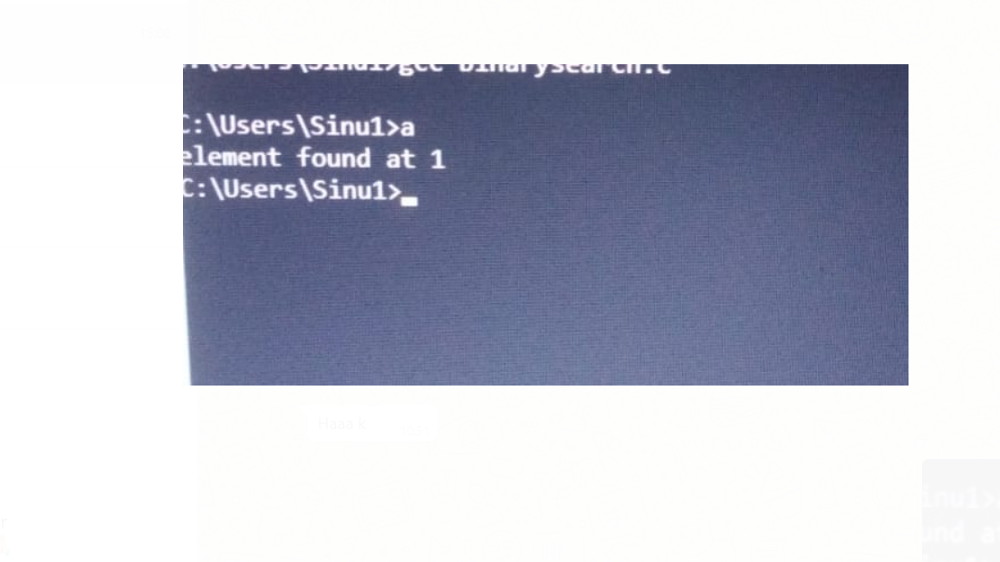
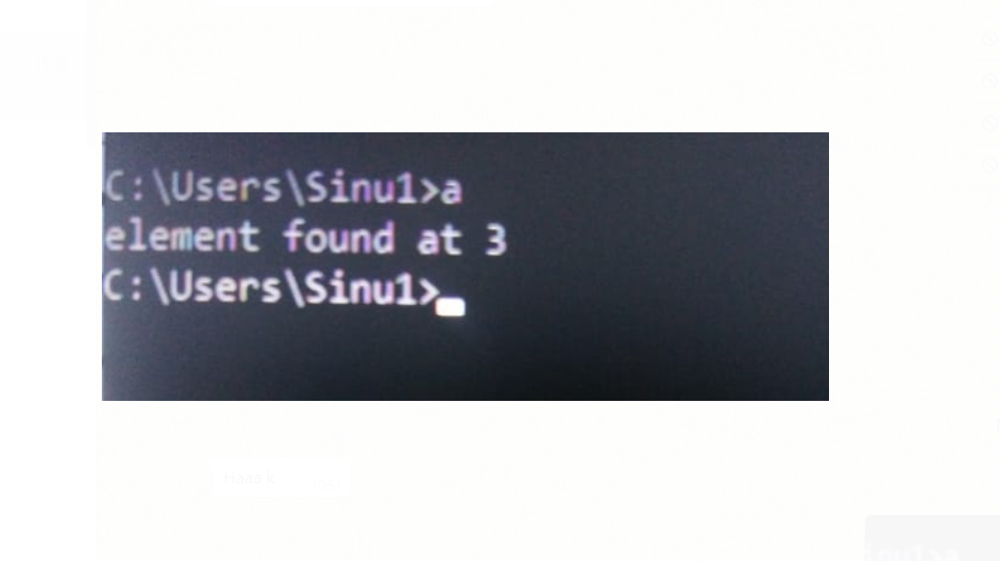
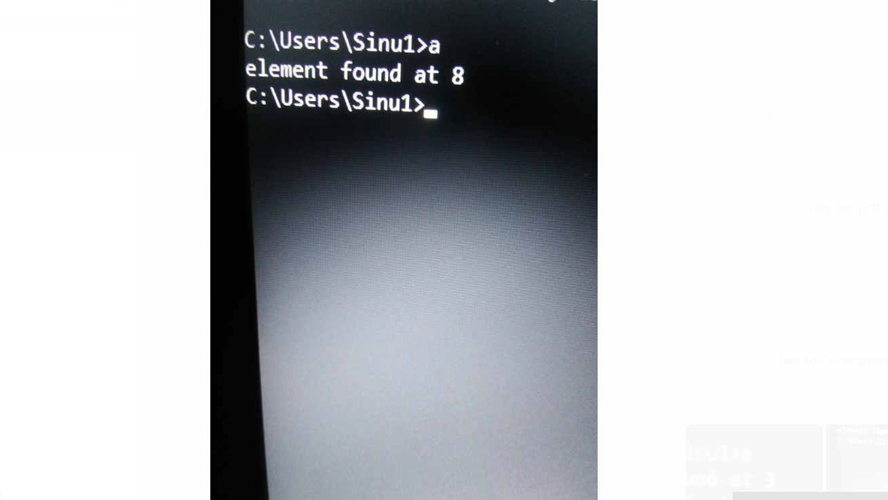
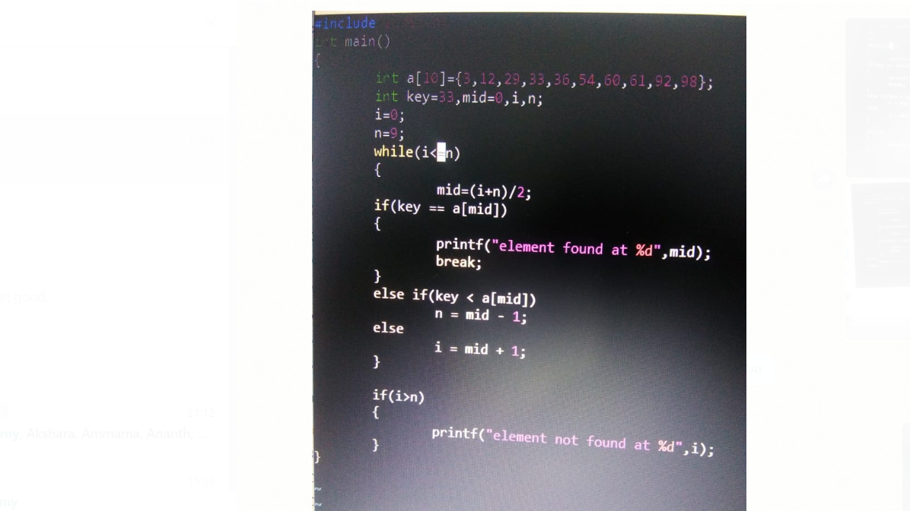

#AIM OF THE EXPERIMENT: 
Writing a binary search program using non recursive functions..

##BINARY SEARCH:
 
It is a sorting algorithm,that is used to search an element in a sorted array.So,an array must be sorted to apply binary search on the array.

###STEP BY STEP PROCEDURE:

First we will be taking an array of 10 elements in a sorted way i.e a[i]={3,12,29,33,36,54,60,61,92,98}.

Key numbers to be searched are 12,92,33.

First element position is taken as "i" which is "0" and the last element position is taken as "n" which is "9".

In binary search we will be comparing every element by taking the mid value of the array.

Mid value is given by MID = (i+n)/2.

In my array mid value is 36 which is in 4th position.

We use while loop here(i<n),if key value is at mid value then we will be printing that element found at mid that is 4th position.

Else if the key value is before the mid value(key<a[mid]),then "i" is taken as "0" and "n" is taken as "mid -1".

If the key value is after the mid value (key>mid), then "i" is taken as "mid +1" and n is "9".

The key value is searched from 0th position of array.MY first key value is "12" and the element is searched from 0th position..

IN 0th position i=0 and n=3,(0+3/2) which is 1,And my key is in 1st position of the array as we are saying to print the position of key value..

My another key value is 33,which is already in mid -1 position where my n value is "3".so output is given as element found in 3.

My next key value is 92 which is after the mid value,so i=mid+1 and n=9.
 when i=5 and n=9,(5+9)/2=7,which is not correct.
 
 when i=7 and n=9,(7+9)/2=8,which is correct position.So the output is obtained as element found at 8 as we are saying to print it.
 
 when the condition(i>n) is true then the output obtained is element not found as we are saying to print it..
 
 OUTPUT OBTAINED:
 for key 12:
 
 
 for key 33:
 
 
 for key 92:
 
 
 program:
 

