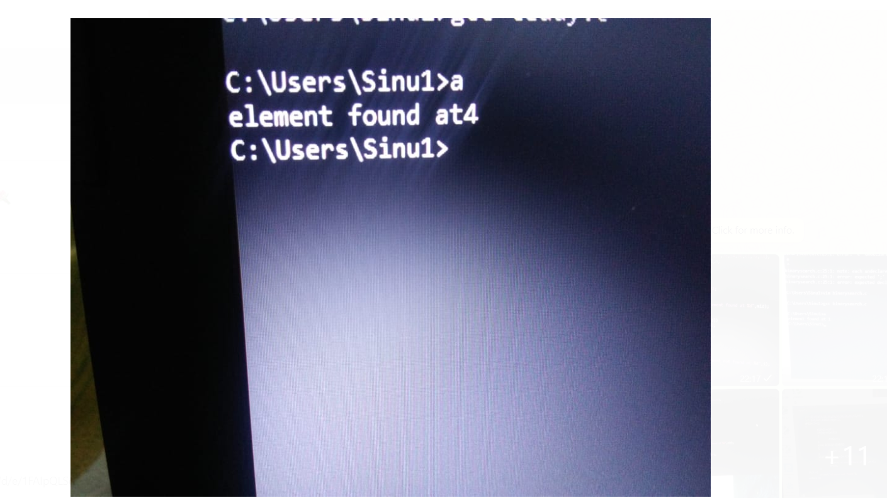
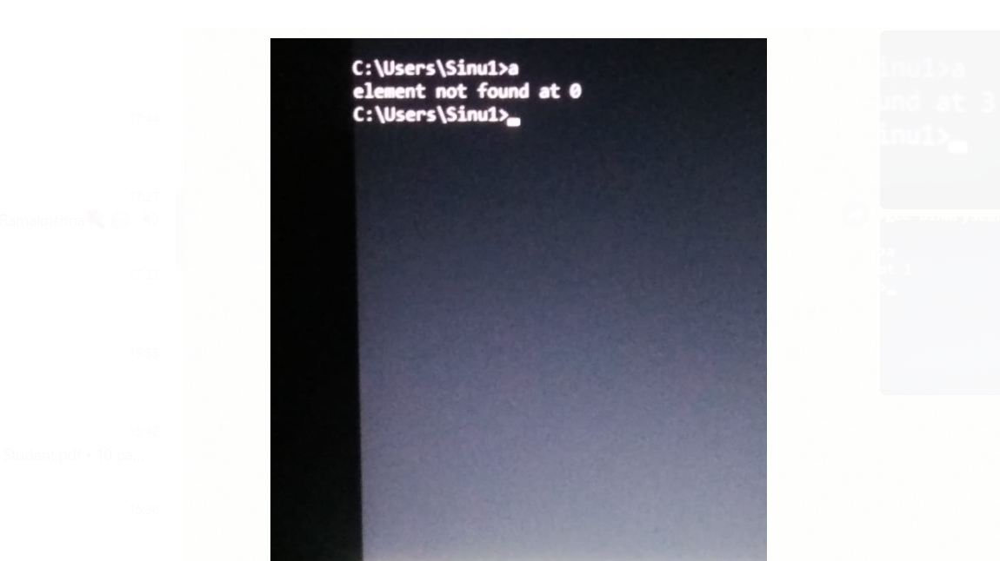

AIM : Writing a linear search program using recursive functions.

RECURSIVE FUNCTIONS : A recursive function is a function that calls itself during execution.This enables the function to repeat itself several
times. 

STEP BY STEP PROCEDURE:
 
In the linear function declare the variables a,element,i,n,index.Which is user defined function.a[i]={12,61,33,92,36,3,29,98,54,60}.

Check every element in the array until the value of i is less than or equal to n.

If the key element matches with the element in the array then return hte value of index to the main function.

Else repeat the procedure by incrementing the value of i by 1 every time.
 
If the value of i reaches the value greater than n then return -1 to the main function.

In the main function declare the variables.

if the value of index is equal to -1 then print element is not found to the output.

else print the index of the element to the output.

OUTPUT:

output 1(key element = 36) :The element 36 is made to match with every element of the array.When it reaches the 4th index element it matches and returns the position of key element.

 
output 2(key element =100):The element 100 is made to match with every element of the array,as the element doesnt match with the elements in the array it reurns the element is not found.

