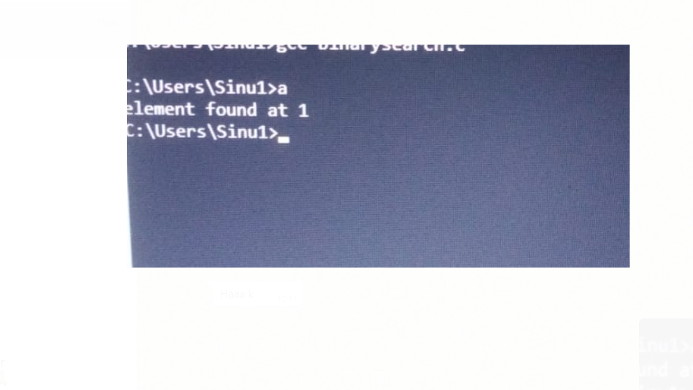

AIM : Writing a binary search program using recursive functions.

STEP BY STEP PROCEDURE:

In binary search we need to sort the 
array.

Consider a key element.Here the starting index is 0 and ending index is 9.

Find the mid value by start + end/2(Compare the keyelement and midvalue by using binarysearch function declared.).

Then there will be three cases.

Case 1:if the mid = element return mid value

Case 2:if the mid> element return n = mid - 1.

Case 3:if the mid < element return i = mid + 1.

We have to continue the process until the key element is found or search space is exhuasted.

OUTPUT:

OUTPUT 1(key element= 12) Mid value is (0+9/2) = 4.5.In this case mid > element then n= mid - 1 and the procedure will continue until key element matches with mid position then we will get index of the key element as 1.

