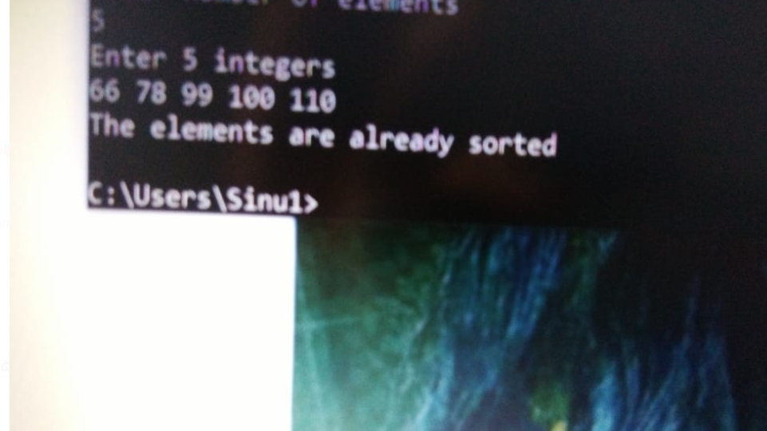
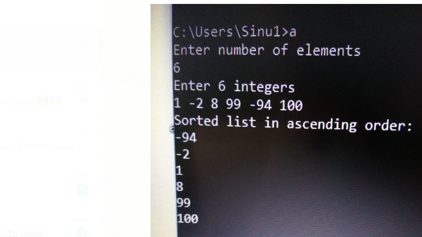
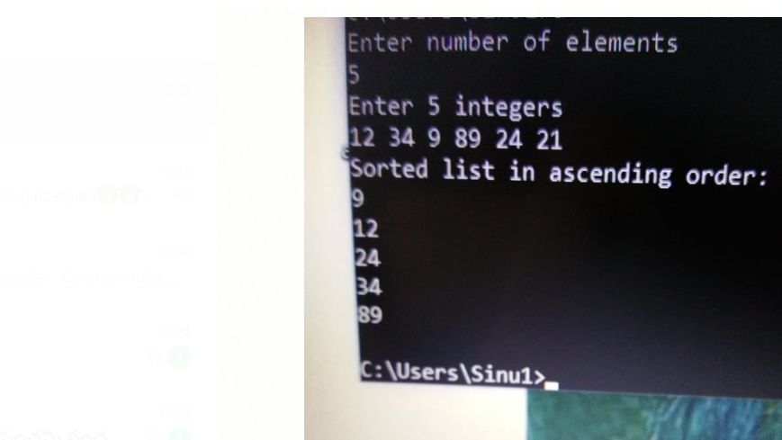
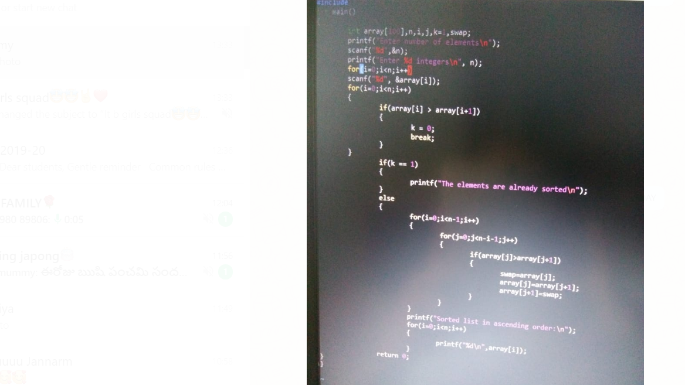

Aim of the experiment:
To perform bubble sort of an unsorted and sorted array.
Array (i):66,78,99,100,110

Array (ii): 1,-2,8,99,-94,100

Array (iii):12,34,9,89,24,21 

Brief description of Bubble sort:

Bubble Sort is a simple algorithm which is used to sort a given set of n elements
provided in form of an array with n number of elements. Bubble Sort compares all
the element one by one with the adjacent elements and sort them based on their
values.

If the given array has to be sorted in ascending order, then bubble sort will start by
comparing the first element of the array with the second element, if the first element
is greater than the second element, it will swap both the elements, and then move on
to compare the second and the third element, and so on.

If we have total n elements, then we need to repeat this process for n-1 times.

Step-by-step-procedure:

1. Starting with the first element, compare the current element with the next
element of the array.

2. If the current element is greater than the next element of the array, swap
them.

3. If the current element is less than the next element, move to the next element.

4. Repeat step 1.

Output obtained:
(i)Bubble sorting of sorted array

Procedure of obtaining output:
1. Read elements of the array and number of the array elements.

2. Here n = 5 and array = {66,78,99,100,110}

3. In bubble sorting, the elements of the array are swapped and
arranged in ascending order.

4. But, in this case, the elements are already sorted.

5. So, after entering the elements (that are already sorted), it
 prints &amp; quot;The elements are already sorted.&amp; quot;

ii) Bubble sorting of unsorted array.

Procedure of obtaining output:

1. Read elements of the array and number of the array elements.

2. Here n = 6 and array = {1,-2,8,99,-94,100}

1 st iteration:{1,-2,8,99,-94,100}
1 AND –2,-2 SWAPS
-2,1,8,99,-94,100
-2,1,8,99,-94,100
-2,1,8,99,-94,100
99 AND -94 ,-94 SWAPS
-2,1,8,-94,99,1100

2 nd iteration:

-2,1,8,-94,99,100
-2,1,8,-94,99,100
-2,1,-94,8,99,100
-2,1,-94,8,99,100
-2,1,-94,8,99,100

3 RD ITERATION:

-2,1,-94,8,99,100
-2,-94,1,8,99,100
-2,-94,1,8,99,100
-2,-94,1,8,99,100
-2,-94,1,8,99,100

4 TH ITERATION:

-94,-2,1,8,99,100
-94,-2,1,8,99,100
-94,-2,1,8,99,100
-94,-2,1,8,99,100
-94,-2,1,8,99,100

5 TH ITERATION:

-94,-2,1,8,99,100
-94,-2,1,8,99,100
-94,-2,1,8,99,100
-94,-2,1,8,99,100
-94,-2,1,8,99,100

By the end of the FIFTHiteration, the fourth greatest
element lies at the end. Here, it is 100 which is last fourth
from the end. And the array elements (after the com
pletion of 5 th iteration) are:
-94,-2,1,8,99,100

(iii)Bubble sorting of unsorted array
Procedure of obtaining output:
1. Read elements of the array and number of the array elements.

2. Here n = 5 and array = {12,34,9,89,24,21}

1 st iteration:
12,34,9,89,24,21
12,9,34,89,24,21
12,34,9,89,24,21
12,34,9,24,89,21
12,34,9,24,21,89

2 nd iteration:
12,34,9,24,21,89
12,9,34,24,21,89
12,9,24,34,21,89
12,9,24,21,34,89
12,9,24,21,34,89

3 rd iteration:

9,12,24,21,34,89
9,12,24,21,34,89
9,12,24,21,34,89
9,12,21,24,34,89
9,12,21,24,34,89

4 TH ITERATION:

9,12,21,24,34,89
9,12,21,24,34,89
9,12,21,24,34,89
9,12,21,24,34,89
9,12,21,24,34,89

5 TH ITERATION:

9,12,21,24,34,89
9,12,21,24,34,89
9,12,21,24,34,89
9,12,21,24,34,89
9,12,21,24,34,89

By the end of the fourth iteration, the fifth greatest
element lies at the end. Here, it is 89 which is last fourth

from the end. And the array elements (after the com
pletion of 5 th iteration) are:9,12,21,24,34,89.

OUTPUT:

for sorted array

for unsorted array{1,-2,8,99,-94,100}

for unsorted array{12,34,9,89,24,21}

program:

